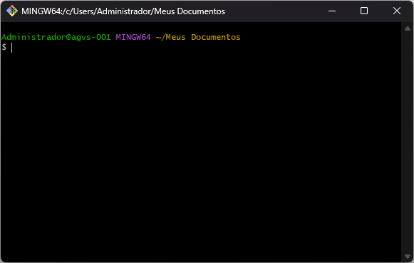
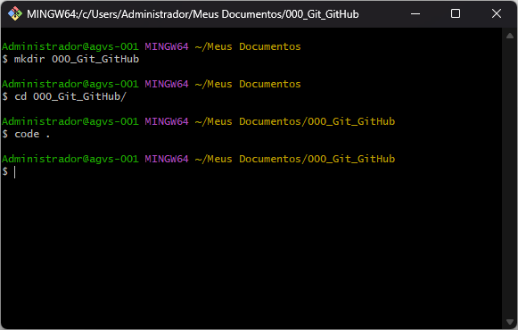
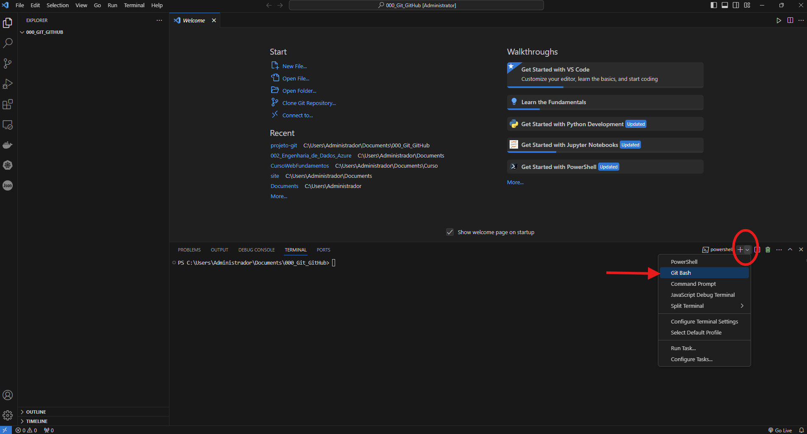
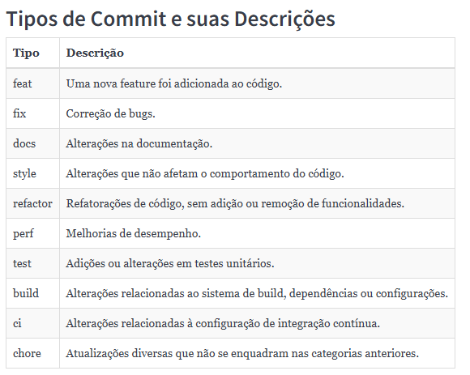
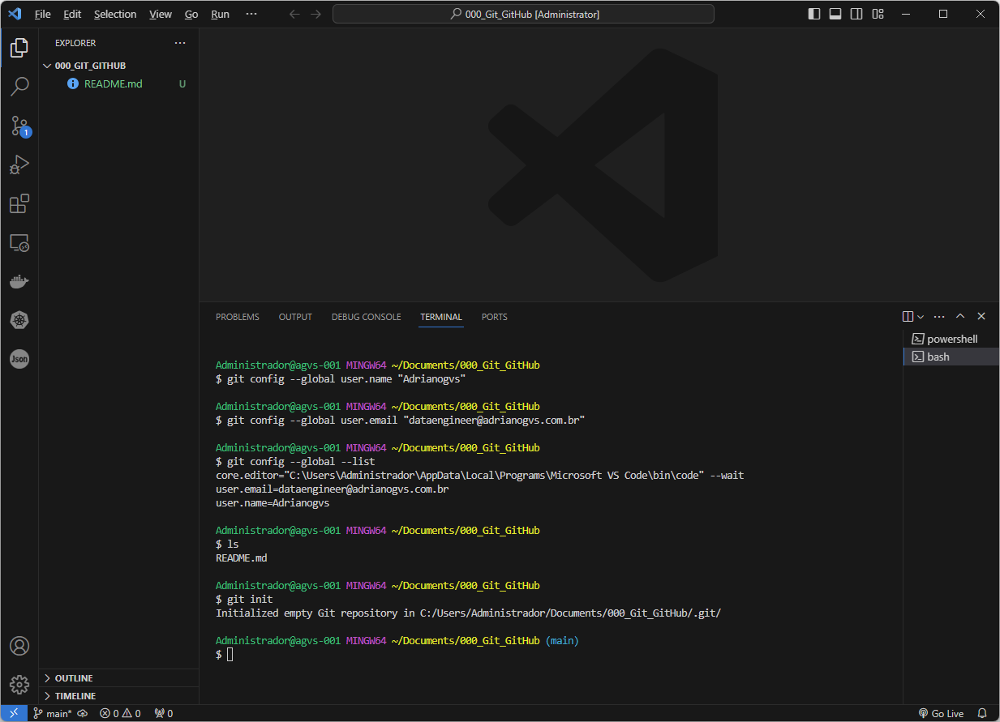

# Introdução ao Git e Controle de Versão

## O que é Controle de Versão?
Controle de versão é uma prática essencial no desenvolvimento de software, permitindo gerenciar e acompanhar alterações feitas em arquivos ao longo do tempo. Com um sistema de controle de versão como o Git, é possível:

- **Rastrear Mudanças**: Saber quem fez o que e quando.
- **Reverter Alterações**: Voltar para versões anteriores caso necessário.
- **Colaborar**: Permitir que várias pessoas trabalhem em paralelo no mesmo projeto.
- **Integrar Contribuições**: Unificar alterações feitas por diferentes desenvolvedores.

Neste documento, você aprenderá a configurar e utilizar o Git em um projeto de forma prática e eficiente.

---

## Passos Iniciais

### 1. Navegando até o Local do Projeto
Abra o terminal Git Bash e utilize o comando `cd` (change directory) para navegar até o diretório onde deseja criar o projeto. Por exemplo:

```bash
cd "C:/Users/Administrador/Meus Documentos"
```
Esse comando indica ao Git Bash para acessar a pasta **Meus Documentos**.



### 2. Criar um Diretório para o Projeto
Para organizar seu trabalho, crie uma nova pasta para o projeto utilizando o comando `mkdir` (make directory):

```bash
mkdir 000_Git_GitHub
```
Em seguida, entre na pasta criada:

```bash
cd 000_Git_GitHub
```

### 3. Abrindo o VSCode
Dentro do diretório do projeto, abra o Visual Studio Code usando o comando:

```bash
code .
```
Esse comando abre o editor diretamente no diretório atual, facilitando o gerenciamento de arquivos do projeto.



### 4. Alterando o Terminal para Git Bash no VSCode
No VSCode, localize a área de terminal na parte inferior da tela. Caso o terminal padrão seja o **PowerShell**, clique na seta ao lado de "powershell" e selecione **Git Bash** conforme mostrado na imagem fornecida. Isso garante que você estará utilizando o terminal correto para os comandos do Git.



---
## Tipos de Commit e suas Descrições




## Configurando o Git

### 1. Configurar Nome de Usuário e Email
Antes de iniciar o uso do Git, é necessário configurar suas credenciais. Digite os seguintes comandos:

```bash
git config --global user.name "SeuNome"
git config --global user.email "seuemail@exemplo.com"
```
Essas informações serão usadas para identificar as alterações que você realizar nos repositórios.

### 2. Verificar Configurações
Para confirmar se as credenciais foram configuradas corretamente, utilize:

```bash
git config --global --list
```
Isso exibiraá todas as configurações globais do Git, incluindo o nome de usuário e o email.

---

## Inicializar um Repositório
Dentro do diretório do projeto, inicialize um repositório Git com o comando:

```bash
git init
```
Este comando cria uma pasta oculta chamada **.git**, que é onde o Git armazena o histórico e as configurações do repositório.



---

## Principais Comandos do Git

### Verificar o Status do Repositório
Para ver quais arquivos foram modificados, adicionados ou removidos, use:

```bash
git status
```

### Adicionar Arquivos para Rastreamento
Para adicionar arquivos ao repositório e prepará-los para commit:

```bash
git add nome_do_arquivo
```
Para adicionar todos os arquivos:

```bash
git add .
```

### Realizar um Commit
Depois de adicionar os arquivos, salve as alterações no histórico do Git:

```bash
git commit -m "Mensagem descritiva das alterações"
```

### Remover Arquivos do Repositório
Para remover um arquivo do repositório, utilize:

```bash
git rm arquivo2.py
```
Após isso, faça um commit para registrar a remoção:

```bash
git commit -m "Removendo o arquivo arquivo2.py"
```

### Reverter para um Commit Anterior
Caso precise restaurar um estado anterior do projeto, use:

```bash
git reset --hard [ID do commit]
```
Esse comando retorna todos os arquivos para o estado de um commit específico. Por exemplo, se você deseja reverter o projeto para o commit com ID `a1b2c3d`, basta executar o seguinte comando:

```bash
git reset --hard a1b2c3d
```

Depois de executar o comando, todo o seu repositório voltará ao estado exato daquele commit. Esse processo é útil para desfazer alterações que não deram certo ou para testar um estado específico do projeto. Por isso, é importante fazer o `git add` de forma gradual, garantindo que as mensagens de commit sejam claras para identificar o ponto correto de reversão.

### Verificar o Histórico de Commits
Para visualizar o histórico dos commits, use:

```bash
git log
```
Esse comando mostra todas as mensagens, datas e IDs dos commits realizados no repositório.

### Gerenciar Ramificações (*Branches*)
Para trabalhar em funcionalidades separadas, é comum criar ramificações. Aqui estão os comandos principais:

- Listar as ramificações existentes:
  ```bash
  git branch
  ```
- Criar uma nova ramificação:
  ```bash
  git branch nome-da-branch
  ```
- Renomear a ramificação atual:
  ```bash
  git branch -m novo-nome
  ```
- Deletar uma ramificação:
  ```bash
  git branch -d nome-da-branch
  ```
Trabalhar em ramificações ajuda a manter a *main* estável, permitindo que novas funcionalidades sejam testadas separadamente antes de serem integradas.

### Trocar de Ramificação
Para alternar entre ramificações, utilize:

```bash
git checkout nome-da-branch
```
Se desejar criar uma nova ramificação e já acessá-la, use:

```bash
git checkout -b nome-da-branch
```

### Integrar Ramificações
Depois de concluir o trabalho em uma ramificação, você pode integrá-la à principal com:

```bash
git merge nome-da-branch
```
Esse comando combina as alterações feitas em outra ramificação com a atual.

### Configurar Informações de Conta
Para alterar ou configurar informações de conta no Git, use:

```bash
git config --global user.name "Seu Nome"
git config --global user.email "seuemail@exemplo.com"
```
Essas configurações podem ser feitas de forma **global** (para todos os repositórios) ou **local** (apenas para o repositório atual).

### Remover Arquivos Grandes do Histórico
Se você adicionou acidentalmente um arquivo muito grande ao repositório e precisa removê-lo, utilize:

```bash
git filter-repo --invert-paths --path arquivo.py --force
```
Esse comando remove completamente o arquivo especificado de todo o histórico do Git. Use com cuidado para evitar a perda de dados importantes.

---

## Boas Práticas no Uso do Git

### 1. Commit Semântico
Uma mensagem de commit clara e objetiva facilita a compreensão do trabalho realizado em cada etapa do projeto. Ela ajuda a identificar rapidamente alterações, resolver bugs e manter o projeto organizado. Há várias padronizações para mensagens de commit que podem ser consultadas online, e algumas delas são amplamente adotadas por grandes projetos. Considere explorar essas sugestões para criar um fluxo de trabalho consistente.

### 2. Validação com Pre-commit
Outra boa prática é utilizar o *pre-commit*, que executa verificações automáticas antes de cada commit. Isso ajuda a garantir que o código está em conformidade com as regras de estilo e segurança definidas no projeto.

Para configurá-lo, instale o pacote *pre-commit* no seu ambiente de desenvolvimento, crie um arquivo chamado `.pre-commit-config.yaml` e defina nele as regras desejadas. Depois, execute:

```bash
pre-commit install
```
A partir disso, toda vez que um commit for feito, as validações serão realizadas automaticamente. Caso algo esteja fora do padrão, o *pre-commit* pode corrigir ou alertar sobre o problema.

Exemplo de configuração no arquivo `.pre-commit-config.yaml`:

```yaml
repos:
-   repo: https://github.com/pre-commit/pre-commit-hooks
    rev: v2.3.0
    hooks:
    -   id: check-yaml                     # Verifica a sintaxe de arquivos YAML
    -   id: end-of-file-fixer              # Garante que arquivos terminem com uma nova linha
    -   id: trailing-whitespace            # Remove espaços em branco no final das linhas
-   repo: https://github.com/psf/black
    rev: 22.10.0
    hooks:
    -   id: black                          # Formata código Python
-   repo: https://github.com/pre-commit/mirrors-flake8
    rev: v3.9.2
    hooks:
    -   id: flake8                         # Verifica o padrão de código Python conforme PEP8
-   repo: https://github.com/detailyang/pre-commit-shell
    rev: v2.0.0
    hooks:
    -   id: shellcheck                     # Analisa scripts Shell para detectar erros comuns
    -   id: shfmt                          # Formata automaticamente scripts Shell
-   repo: https://github.com/pre-commit/pre-commit-hooks
    rev: v3.4.0
    hooks:
    -   id: pretty-format-json             # Garante que arquivos JSON estejam bem formatados
```
Esses *hooks* serão executados sempre que você fizer um commit, ajudando a manter o padrão e a qualidade do código. Para explorar mais opções de *hooks*, consulte a [documentação do pre-commit](https://pre-commit.com/). Para explorar mais opções de *hooks*, consulte a [documentação do pre-commit](https://pre-commit.com/).

---

Com essas boas práticas e comandos, você estará preparado para utilizar o Git de maneira eficaz e profissional em seus projetos.

